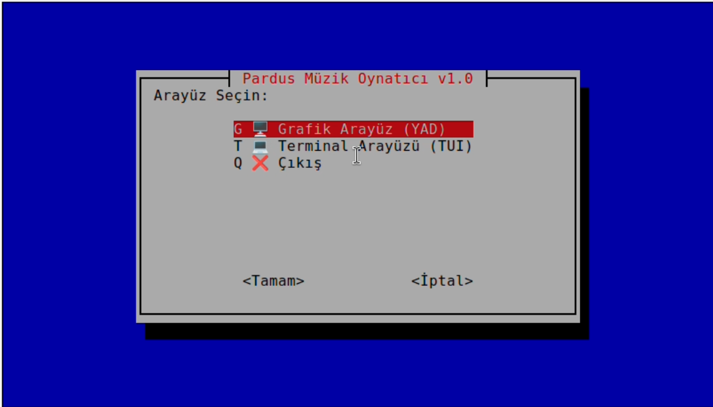
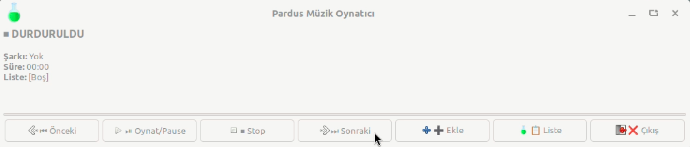
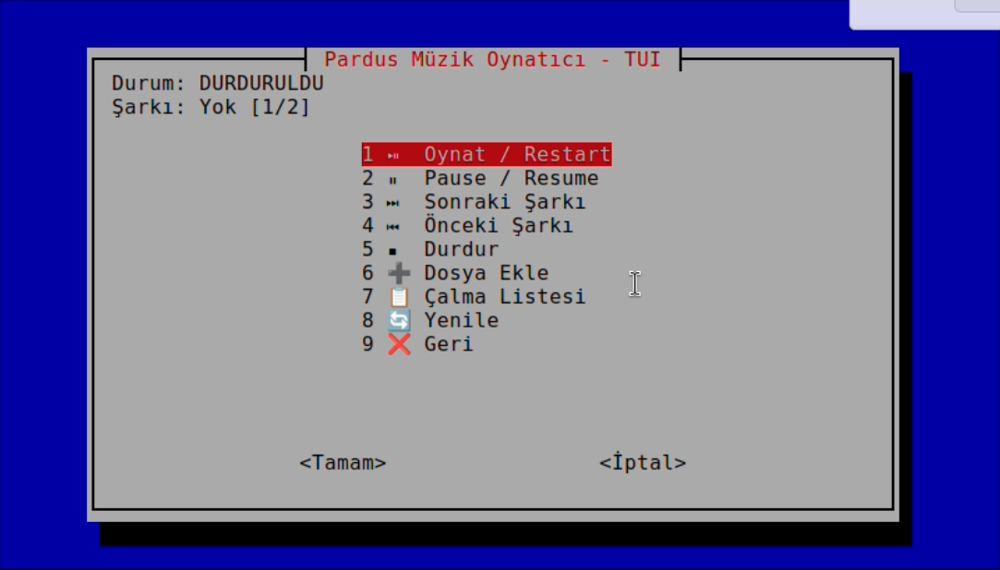

# Pardus Müzik Oynatıcı

Pardus Linux için geliştirilmiş hem grafik hem de terminal arayüzü sunan modern ve kullanışlı bir müzik çalar uygulaması.

## Kılavuz Videosu

Detaylı kullanım kılavuzu için YouTube videomuzu izleyebilirsiniz:

[[Kılavuz Videosu]](https://www.youtube.com/watch?v=QVcJiZsK1GY)

## Özellikler

- **Grafik Arayüz (GUI)**: YAD kullanarak modern ve kullanıcı dostu arayüz
- **Terminal Arayüzü (TUI)**: Whiptail ile terminal tabanlı menü sistemi
- **Tek Dosya**: Tüm özellikler tek bir bash script içinde
- **Gerçek Zamanlı Süre Gösterimi**: Şarkının kaçıncı saniyede olduğunu gösterir
- **Otomatik Yenileme**: GUI arayüzü her saniye otomatik güncellenir
- **Çalma Listesi Yönetimi**: Şarkı ekleme, silme ve listeden seçerek çalma
- **Oynatma Kontrolleri**: Oynat, duraklat, durdur, sonraki/önceki şarkı
- **Otomatik Geçiş**: Şarkı bittiğinde otomatik sonraki şarkıya geçer
- **Akıllı Önceki Butonu**: 5 saniyeden az geçtiyse önceki şarkıya, fazlaysa başa sarar

## Ekran Görüntüleri

### Arayüz Seçim Menüsü


### GUI Kontrol Paneli


### GUI Dosya Ekleme


### TUI Menüsü


## Gereksinimler

Bu scriptin çalışması için aşağıdaki paketlerin yüklü olması gerekmektedir:

| Paket | Açıklama | Zorunlu |
|-------|----------|---------|
| `mpg123` | MP3 dosyalarını çalmak için | ✅ Evet |
| `yad` | Grafik arayüz için | ⚠️ GUI için gerekli |
| `whiptail` | Terminal arayüzü için | ⚠️ TUI için gerekli |

## Kurulum

### Pardus için Tek Komut

```bash
sudo apt update && sudo apt install -y mpg123 yad whiptail
```

### Projeyi İndirme

```bash
git clone https://github.com/AliYilmaz16/Pardus-Muzik-Calar.git
cd Pardus-Muzik-Calar
chmod +x mpg123-oynatici.sh
```

### Çalıştırma

```bash
./mpg123-oynatici.sh
```

Sistem genelinde kullanmak için:

```bash
sudo cp mpg123-oynatici.sh /usr/local/bin/pardus-oynatici
pardus-oynatici
```

## Kullanım

### Başlangıç

Scripti çalıştırdığınızda önce arayüz seçim menüsü açılır:

- **G**: Grafik Arayüz (YAD)
- **T**: Terminal Arayüzü (TUI)
- **Q**: Çıkış

### Grafik Arayüz (GUI) Kullanımı

1. Ana menüden **G** seçeneğini seçin
2. Açılan pencerede şu kontroller bulunur:

| Buton | İşlev |
|-------|-------|
| ⏮ Önceki | Önceki şarkıya geç (5 sn içindeyse başa sar) |
| ⏯ Oynat/Pause | Oynatmayı başlat veya duraklat |
| ⏹ Stop | Çalmayı tamamen durdur |
| ⏭ Sonraki | Sonraki şarkıya geç |
| ➕ Ekle | Yeni MP3 dosyaları ekle |
| 📋 Liste | Çalma listesini görüntüle/yönet |
| ❌ Çıkış | Ana menüye dön |

3. **Şarkı Ekleme**: "Ekle" butonuna tıklayarak dosya seçici penceresinden birden fazla MP3 dosyası seçebilirsiniz.

4. **Çalma Listesi**: "Liste" butonundan şarkıları görebilir, seçip çalabilir veya silebilirsiniz.

### Terminal Arayüzü (TUI) Kullanımı

1. Ana menüden **T** seçeneğini seçin
2. Menüden istediğiniz işlemi seçin:

| Seçenek | İşlev |
|---------|-------|
| 1 | Oynat / Restart |
| 2 | Pause / Resume |
| 3 | Sonraki Şarkı |
| 4 | Önceki Şarkı |
| 5 | Durdur |
| 6 | Dosya Ekle |
| 7 | Çalma Listesi |
| 8 | Yenile (Süreyi güncelle) |
| 9 | Geri |

3. **Şarkı Ekleme**: Seçenek 6'yı seçip MP3 dosyasının tam yolunu girin.

## Teknik Detaylar

- **Platform:** Pardus Linux
- **Dil:** Bash Script
- **UI Kütüphaneleri:** YAD (GTK+), Whiptail (ncurses)
- **Ses Motoru:** mpg123
- **Desteklenen Format:** MP3, OGG, WAV

## 🇹🇷 Pardus Uyumluluğu

Bu araç özellikle Pardus işletim sistemi için optimize edilmiştir ve Pardus 23.x sürümüyle tam uyumludur. Tüm bağımlılıklar Pardus'un varsayılan paket depolarından kolayca kurulabilir.

## Notlar

- Script sadece MP3 formatını tam destekler
- Çalma listesi oturum boyunca bellekte tutulur (script kapatıldığında sıfırlanır)
- GUI arayüzü her saniye otomatik yenilenir
- Önceki şarkıya geçerken şarkı 5 saniyeden az çalındıysa başa sarılır

## Sorun Giderme

### YAD Kurulu Değil

```bash
sudo apt install yad
```

### mpg123 Bulunamıyor

```bash
sudo apt install mpg123
```

### Script Çalışmıyor

```bash
chmod +x mpg123-oynatici.sh
```

## Geliştirici Notları

Bu proje Pardus için **Linux Araçları ve Kabuk Programlama** dersi kapsamında geliştirilmiştir. Projede kullanılan temel kavramlar:

- Bash scripting ve fonksiyonlar
- Koşullu ifadeler (if-else, case)
- Döngüler (while, for)
- GUI-TUI arayüzleri (YAD, Whiptail)
- Sinyal yönetimi (STOP, CONT, trap)
- Süreç kontrolü (pgrep, pkill)
- Zaman hesaplama ve formatlama

## Geliştirici

**Ali Yılmaz**  

---

**Not:** Bu proje Pardus Linux üzerinde test edilmiştir ve tam uyumludur.
